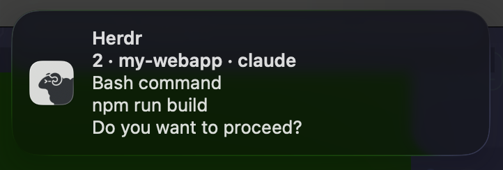
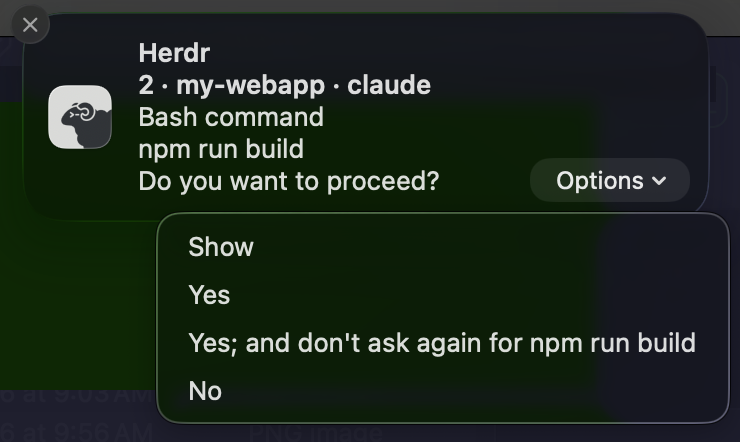
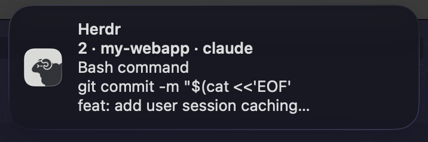
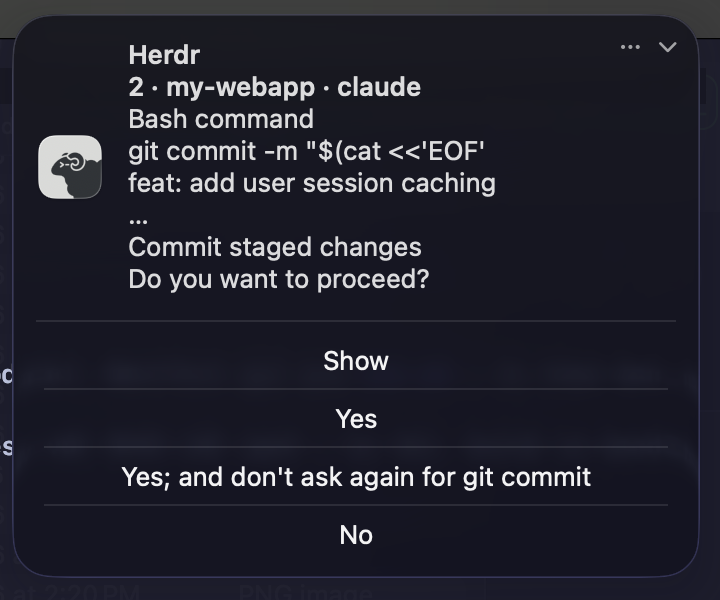

# Prompt Reply

Answer [herdr](https://herdr.dev) agent permission prompts straight from a
macOS notification. When Claude Code (or any agent) stops on a *"Do you want to
proceed?"* prompt, the notification shows its options as buttons — click one
and the answer is typed into the right pane for you.

<p align="center">
  
  <br>
  
</p>

A single Swift binary on `UNUserNotificationCenter` — no runtime, no external
notifier, nothing waiting in the background.

- **Click an option** → its digit is typed into the pane, after re-checking the
  pane is still blocked (answering in the terminal never double-submits)
- **Click the body / Show** → jump to the pane, across workspaces, bringing the
  terminal forward
- **Focus the pane yourself** → the notification is withdrawn as stale
- One notification per pane; a newer prompt replaces the older one

## Install

Needs macOS with the Xcode Command Line Tools (`xcode-select --install` — you
have them if you have git). No other runtime: the plugin is a single Swift
binary compiled at install.

```sh
herdr plugin install cedrus-8864/herdr-prompt-reply
```

The install compiles `HerdrPromptReply.app`, which talks to the system's
notification center directly (`UNUserNotificationCenter` — the supported API,
not the deprecated one CLI notifiers ride on). Posting is fire-and-exit: when
you click, macOS relaunches the binary to deliver your answer, so nothing sits
around waiting.

Then, once:

1. Trigger a notification (any permission prompt), and set **Herdr Prompt Reply**
   to **Alerts** — called **Persistent** on newer macOS — in System Settings →
   Notifications. As a Banner/Temporary it slides away in seconds, taking the
   buttons with it. If the entry is missing there, launch the app once through
   Launch Services to create it (macOS silently refuses the request from a
   terminal-spawned process):

   ```sh
   open "$(herdr plugin list --plugin cedrus.prompt-reply --json | python3 -c \
     "import json,sys; print(json.load(sys.stdin)['result']['plugins'][0]['plugin_root'])")/assets/HerdrPromptReply.app"
   ```
2. If the install output warns that herdr's `[ui.toast] delivery = "system"` is
   set, switch it to `"herdr"` (see below) — otherwise herdr posts a second,
   buttonless notification for the same event.

<details>
<summary>Local development (plugin link)</summary>

`herdr plugin link` skips build commands, so compile the notifier by hand:

```sh
git clone https://github.com/cedrus-8864/herdr-prompt-reply
cd herdr-prompt-reply && ./build-app.sh
herdr plugin link . && herdr server reload-config
```

</details>

## Configuration

Optional — `config.toml` in `herdr plugin config-dir cedrus.prompt-reply`.

| Key | Default | Meaning |
|-----|---------|---------|
| `sound` | `""` | Sound name (`"Ping"`, `"Glass"`, …); empty is silent. |
| `suppress_when_focused` | `true` | Stay quiet when you're already looking at the pane. |
| `notify_done` | `false` | Also notify when an agent finishes (no buttons; click jumps to the pane). |
| `done_dismiss_seconds` | `10` | Auto-withdraw finished notifications after this long; `0` keeps them up. Prompts always stay until answered. |
| `subtitle_format` | `"{workspace} · {agent}"` | Template for the subtitle line — see below. |

### Subtitle template

The notification's second line says *which* session is asking. Because herdr
names tabs `1`, `2`, `3` by default, the raw tab name is a poor identifier, so
the subtitle is a template you control. Tokens:

| Token | Meaning | Example |
|-------|---------|---------|
| `{workspace}` | Workspace label | `herdr` |
| `{agent}` | Agent name, cased for reading | `Claude`, `Codex`, `Hermes` |
| `{topic}` | The agent's live topic (what it's working on) | `Fix the parser bug` |
| `{cwd}` | Basename of the pane's working directory | `my-project` |
| `{tab}` | herdr's tab label | `1` |

`{workspace}` `{agent}` `{topic}` `{cwd}` mean the same as in
[herdr-autolabel](https://github.com/cedrus-8864/herdr-autolabel); note `{tab}`
is the tab's *label*, where autolabel's `{n}` is the tab's position number.

Unknown tokens are left literal. A separator left dangling by an empty token
(e.g. `{workspace} · {agent}` when there's no workspace) is trimmed
automatically. `subtitle_format = ""` gives the minimal form: just
`Claude needs input` / `Claude finished`. When an agent *finishes*,
` — finished` is appended so a completion never looks like a waiting prompt.

```toml
subtitle_format = "{agent}: {topic}"   # -> "Claude: Fix the parser bug"
```

**Recommended setup** — this plugin covers both notification classes, herdr
keeps the in-app toasts:

```toml
# ~/.config/herdr/config.toml
[ui.toast]
delivery = "herdr"
```

```toml
# <herdr plugin config-dir cedrus.prompt-reply>/config.toml
notify_done = true
sound = "Ping"
```

**Minimal / quiet** — prompts only, no sound, nothing on completion: install
and change nothing.

## Long prompts

About three message lines show until you expand the notification, so the tool
name and command come first and the question last. Long commands are compressed
to head `…` tail:

<p align="center">
  
  
</p>

## How it works

On `pane.agent_status_changed` → `blocked` (herdr sets that exactly when an
approval/question UI is visible), the plugin reads the visible screen, parses
the bottom-most numbered option list and the question above it, and posts a
notification whose actions carry the option digits. Clicking an action
relaunches the binary; it re-checks the pane is still blocked, then answers
with `pane send-keys`. On `pane.focused`, the pane's notification is withdrawn.
Unparseable prompts still notify; clicking focuses the pane. Click outcomes are
appended to `~/Library/Logs/HerdrPromptReply.log`.

## Uninstall

```sh
./uninstall.sh                          # unregister + delete the .app bundle
herdr plugin uninstall cedrus.prompt-reply
```

In that order — uninstalling removes the checkout, and the script with it.
Skipping the script is untidy but harmless; macOS prunes the leftovers on its
own schedule. Automating this needs an uninstall hook in herdr, tracked in
[herdr#1791](https://github.com/ogulcancelik/herdr/issues/1791).

## Troubleshooting

- **Buttons vanish before you can click** → the notification style is still
  Banners/Temporary; set **Herdr Prompt Reply** to **Alerts**/**Persistent**.
- **Two notifications per prompt** → herdr's own system toast is on; set
  `[ui.toast] delivery = "herdr"`.
- **No notification at all** → the app bundle is missing; run `./build-app.sh`
  from the plugin directory. Parser check: `assets/HerdrPromptReply.app/Contents/MacOS/HerdrPromptReply --self-test`.
- Posting outcomes: `herdr plugin log list --plugin cedrus.prompt-reply --limit 5`.
  Click outcomes: `tail ~/Library/Logs/HerdrPromptReply.log`.

## Credits

The herdr logo comes from
[dot/herdr-terminal-notifier](https://github.com/dot/herdr-terminal-notifier).
Earlier versions delivered via [alerter](https://github.com/vjeantet/alerter);
the notifier is now a native Swift binary.

## License

MIT
